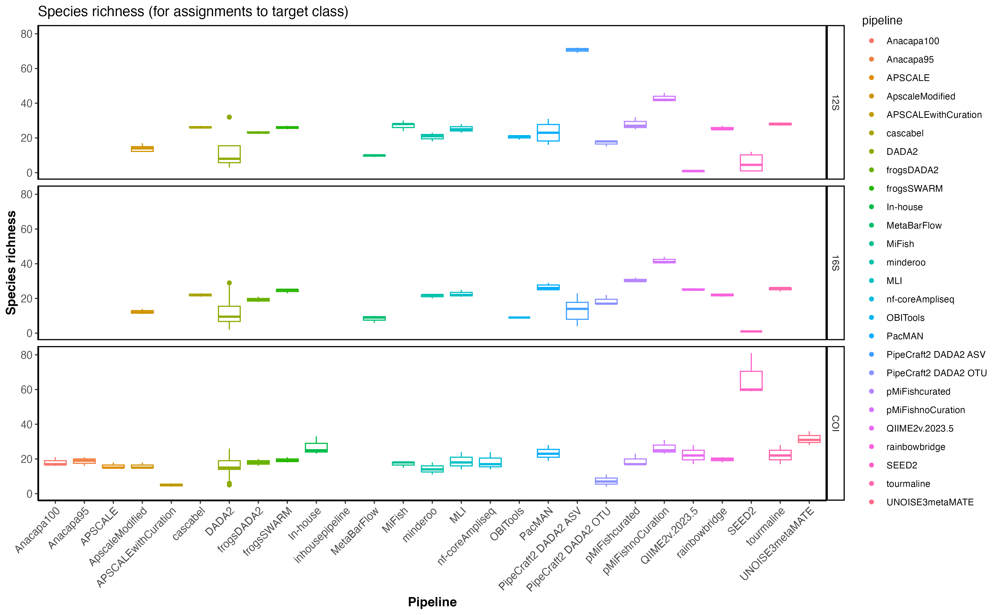
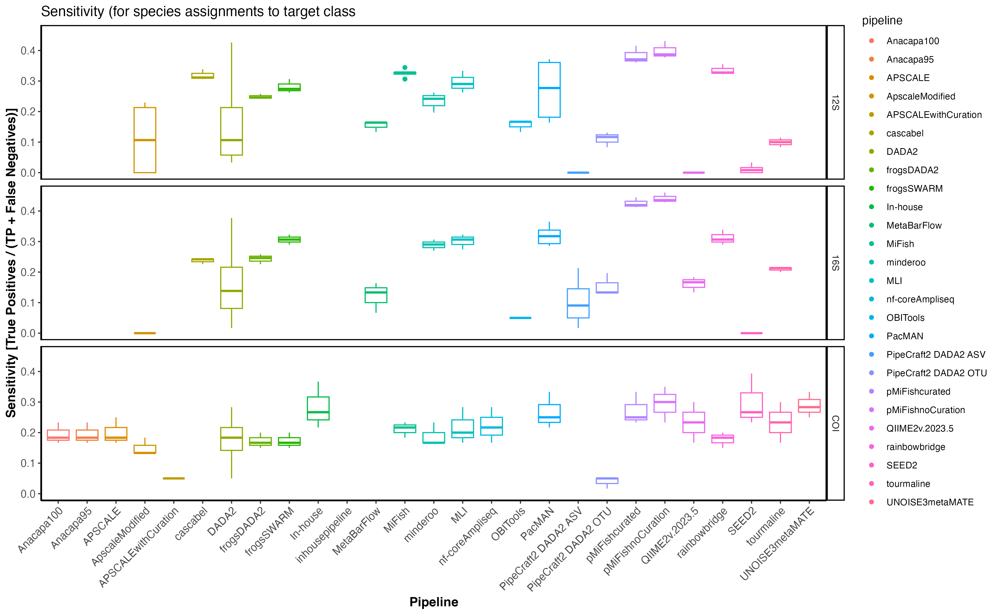
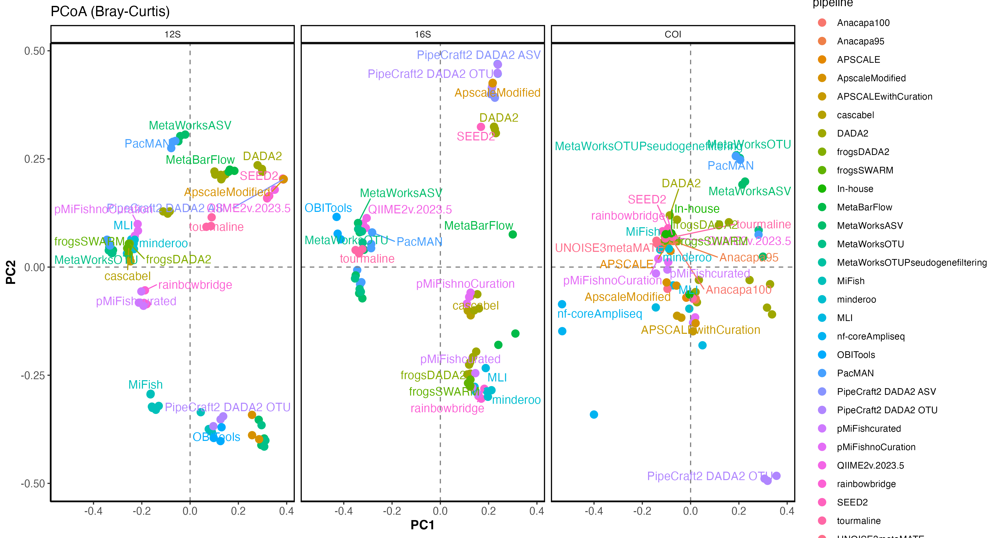
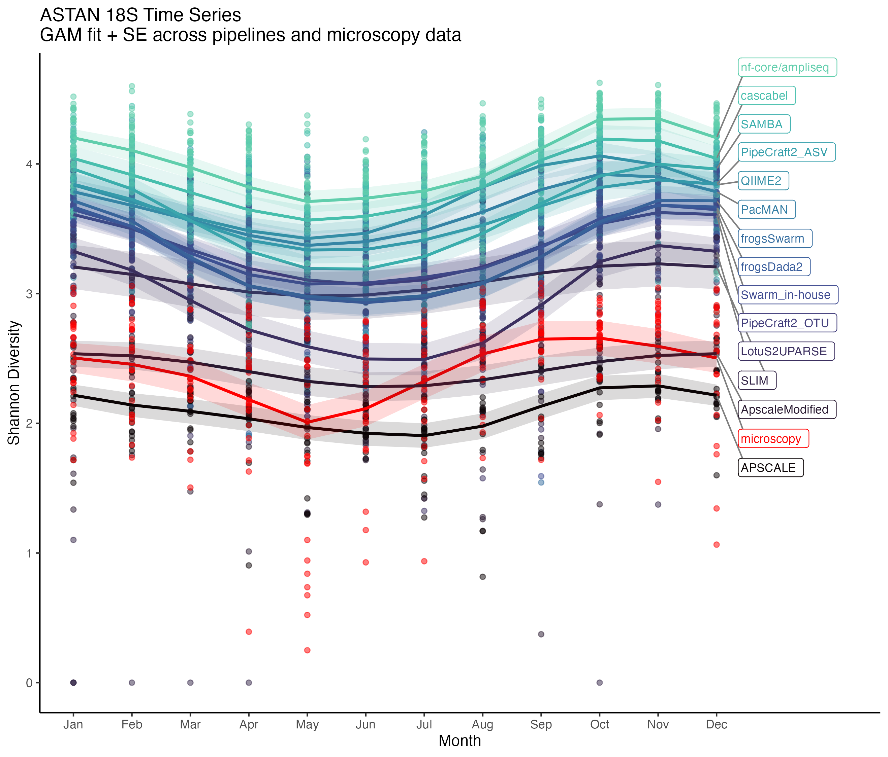
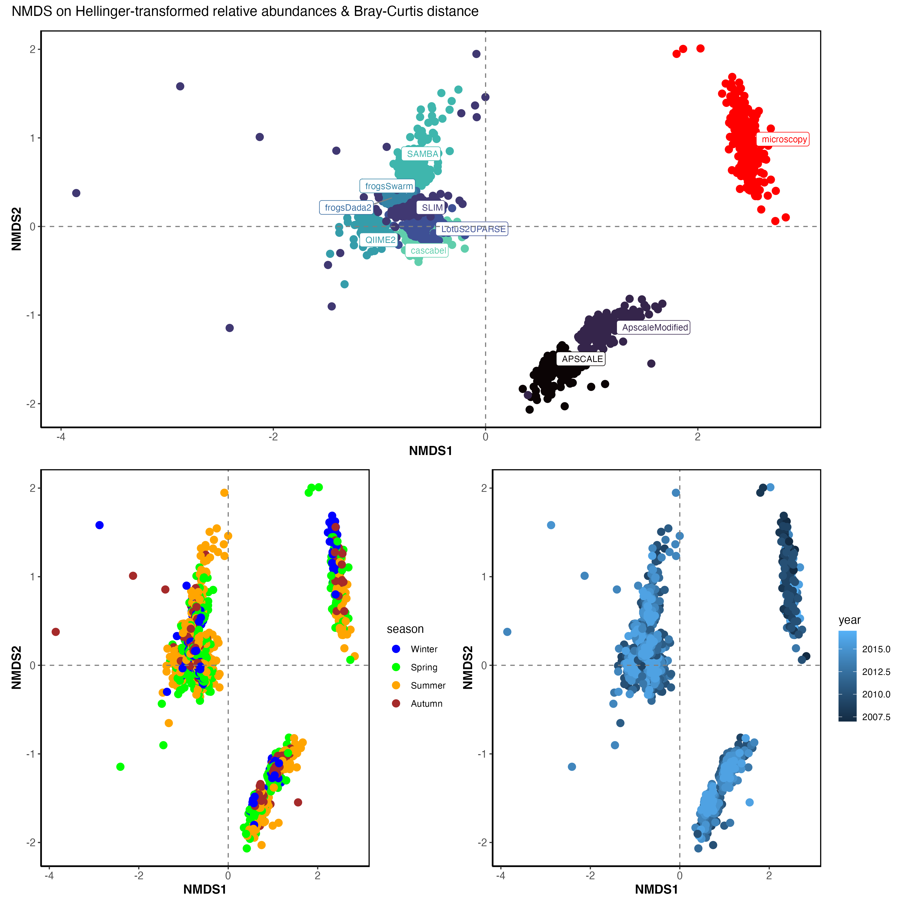
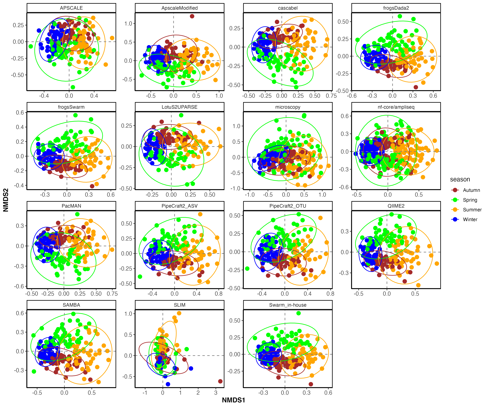

# The Marco-Bolo eDNA Data Analysis Challenge

The [EU Horizon MARCO-BOLO project](https://marcobolo-project.eu/)  launched the [Data Analysis Challenge](https://github.com/marco-bolo/wp2-wp5-workshop/tree/main/) to survey the global environmental DNA (eDNA) community about their use and development of bioinformatics pipelines to process eDNA samples, as well as invite them to contribute their time and methodology towards an extensive comparison of these pipelines. Registered participants were invited to download any of the four metabarcoding datasets provided, analyse these with their pipeline, and provide back the output ASV/OTU and taxonomy tables for comparison. In total, 14 participants submitted a total of 18 output datasets for the [18S protist observatory dataset](https://github.com/marco-bolo/wp2-wp5-workshop/tree/main/?tab=readme-ov-file#plankton-18s-time-series) (Caracciolo *et al.* 2022), and 25 participants submitted a total of 101 output dataset for the [12S, 16S and COI fish aquarium datasets](https://github.com/marco-bolo/wp2-wp5-workshop/tree/main/?tab=readme-ov-file#fish-12s16scoi-aquarium-dataset). The resulting tables were harmonised to be analysed conjointly, and bioinformatics parameters were extracted from the different results files we received. 

The current (v0.1) Zenodo data submission [doi:10.5281/zenodo.17739996](https://doi.org/10.5281/zenodo.17739996) consists of the harmonised tables of participant outputs, the extracted bioinformatics metadata, and several supplementary files necessary for analyses.

In this repository, we are in the process of uploading the harmonised output datasets, code and results of the eDNA data analyis challenge. Our goal is to make the ongoing analyses and results already available to all challenge participants while we are finalising the project. 

## Content

This repository is structured as follow:

:file_folder: &nbsp;[**data/**](https://github.com/marco-bolo/data-analysis-challenge/tree/master/data):
 contains all data necessary to reproduce the analyses.
 
 This folder contains the resulting output tables from each participant, harmonised and merged by target group (protists or fish): 

- challengedata_12s16sCOI.csv: The 101 harmonised output datasets analyzing the fish metabarcoding data from the Lisbon aquarium.

- challengadata_18s.csv: The harmonised output datasets analyzing the protist time series from the ASTAN observatory. Due to storage limitations, the participant output data contains 9 out of 18 submissions for the 18s metabarcoding dataset. The remaining datasets will be added by the end of December 2025.

Key bioinformatic steps and parameters were extracted for each of the submissions included in the challenge data. 
-	metadata_18s.csv: bioinformatics metadata accompanying the challengedata_18s.csv
-	metadata_12s16sCOI.csv: bioinformatics metadata accompanying the challengedata_12s16sCOI.csv
    
    For now, the pipeline outputs are anonymised but the main pipeline steps are categorised in the metadata file. The selected fields describing the bioinformatics steps and parameters were taken from the FAIR eDNA checklist (Takahashi *et al.* 2025).

Finally this folder contains supplementary data necessary to reproduce analyses:
   - aquarium_12s16sCOI_residents.csv: List of resident species in the Lisbon aquarium at the time of sampling.
   - aquarium_12s16sCOI_feed.csv: List of species present in the fish feed of the Lisbon aquarium which could be contaminants.
   - microscopy_harmonised.csv: The microscopy counts data from [Rigaut-Jalabert *et al.* 2021](https://doi.org/10.5281/zenodo.5033180) harmonised to the challengedata_18s.csv
   - metadata_microscopy.csv: Sampling dates of the microscopy samples.
   - metadata_astan.csv: Sampling dates of the ASTAN 18S metabarcoding samples. 

:file_folder: &nbsp;[**scripts/**](https://github.com/marco-bolo/data-analysis-challenge/tree/master/scripts):
 contains R scripts to reproduce comparative analyses and figures.

:file_folder: &nbsp;[**figures/**](https://github.com/marco-bolo/data-analysis-challenge/tree/master/figures):
 produced figures (.png) will be saved to this folder

 ## Comparative analyses

### For the fish 12S, 16S and COI entries:

 - Alpha diversity indices: (target) species richness, (target) Shannon diversity. Here, only species assigned to the class Actinopterygii, Teleostei, Chondrichthyes and Elasmobranchii were taken into account.
    
    
- Detectability: Target species identification, sensitivity of detections compared to the aquarium species list.

    

- Community composition: PCoA
    
 ### For the plankton 18S entries:
 - Fluctuation patterns: GAM model of Shannon diversity ~ month to reveal seasonal patterns

    
 - Community composition: NMDS on the Bray-Curtis distance of Hellinger-tranformed relative abundances

    
    

 
 ## Interactive exploration

*Here, we will host and share the shiny web app to interactively explore the results.*

 ## Acknowledgements

These comparisons would not be possible without the contribution of the Data Analysis Challenge participants who contributed their results: Adam Bennett, Alejandro Abdala, Anders Lanzén, Audrey Bourret, Cassandre Héritier--Tellier, Chris Hempel, Christian Atallah, Daniel Straub, Elisa Banchi, Emese Meglécz, Emma Strand, Evan Morien, Falk Hildebrand, Frank Panitz, Géraldine Pascal & Olivier Rué, Geslain Enora, Jeffrey Miller, Kingsly Chuo Beng, Luka Lenaroto, Luke Thompson, M. Pilar Cabezas, Mads Reinholdt Jensen, Magali Lescot, Marius Eisele, Mykle Hoban, Ngoc-Loi NGUYEN, Nicolas Henry, Oriol Canals, Onur Doğan, Pedro Junger, Saara Suominen, Sean Jungbluth, Sten Anslan, Tomáš Větrovský, Victor Pylro, Vitor Silva and Zachary Gold.

The MARCO-BOLO project is funded by the European Union under the Horizon Europe Programme, Grant Agreement No. 101082021 (MARCO-BOLO). Views and opinions expressed are however those of the author(s) only and do not necessarily reflect those of the European Union or the European Research Executive Agency (REA). Neither the European Union nor the granting authority can be held responsible for them.
UK participants in MARCO-BOLO are supported by the UKRI’s Horizon Europe Guarantee under the Grant No. 10068180 (MS); No. 10063994 (MBA); No. 10048178 (NOC).

 ## References
 - Caracciolo, M., Rigaut-Jalabert, F., Romac, S., Mahé, F., Forsans, S., Gac, J. P., … Simon, N. (2022). Seasonal dynamics of marine protist communities in tidally mixed coastal waters. Molecular Ecology, 31(14), 3761–3783. doi: 10.1111/mec.16539
 - Fabienne Rigaut-Jalabert, Loïc Guilloux, Mark Hoebeke, Samuel Forsans, Mariarita Caracciolo, & Nathalie Simon. (2021). Morphological phytoplankton counts for the SOMLIT-Astan time-series (2007-2017) (Version 2) [Data set]. Zenodo. https://doi.org/10.5281/zenodo.5033180
 - Takahashi, M., Frøslev, T. G., Paupério, J., Thalinger, B., Klymus, K., Helbing, C. C., … Berry, O. (2025). A Metadata Checklist and Data Formatting Guidelines to Make eDNA FAIR (Findable, Accessible, Interoperable, and Reusable). Environmental DNA, 7(3). doi: 10.1002/edn3.70100
 
